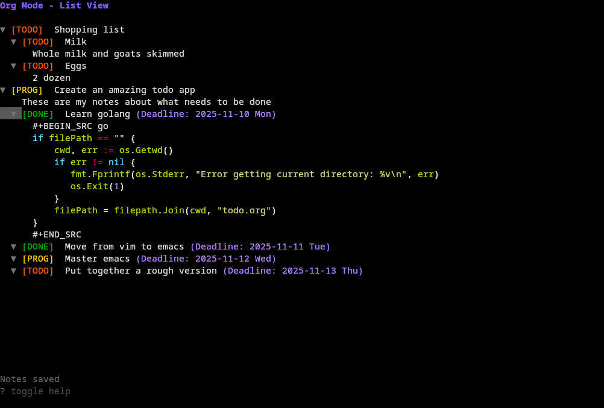
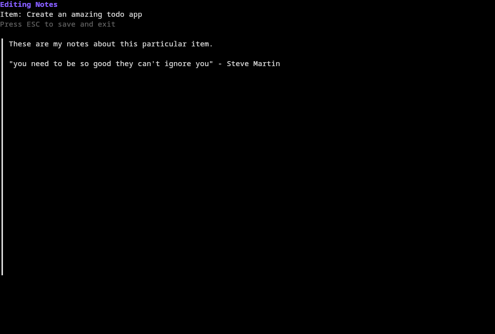
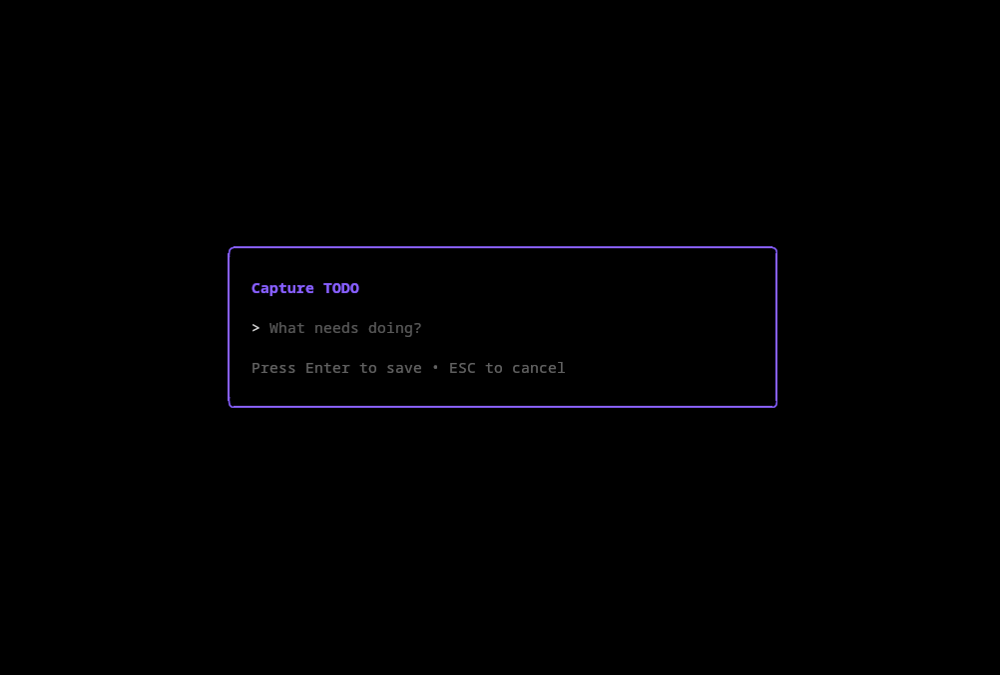
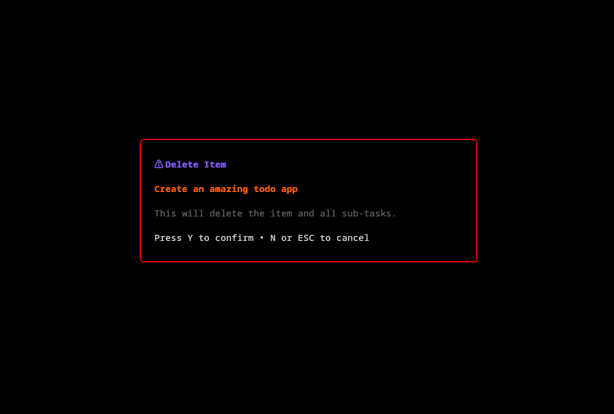
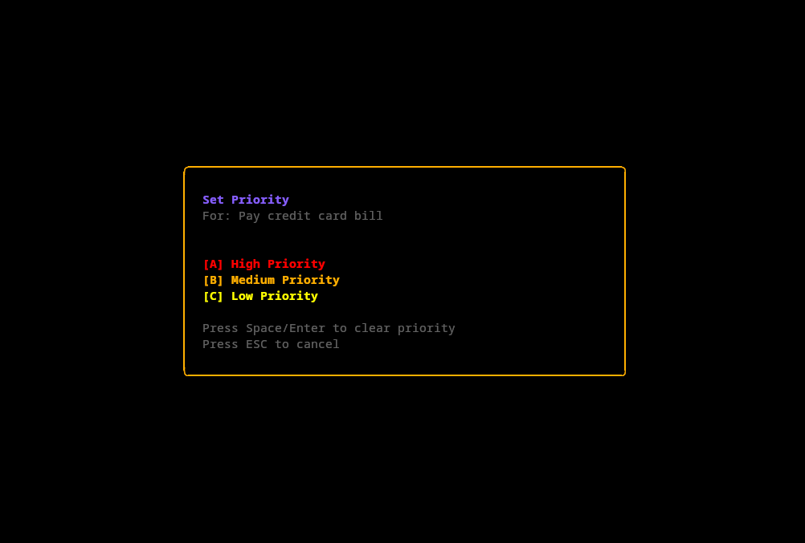
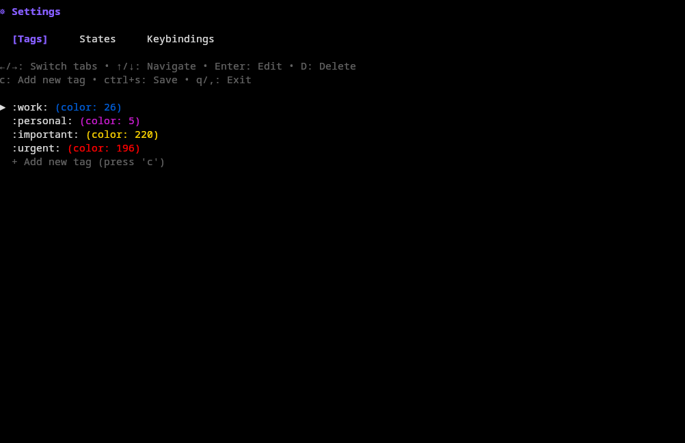
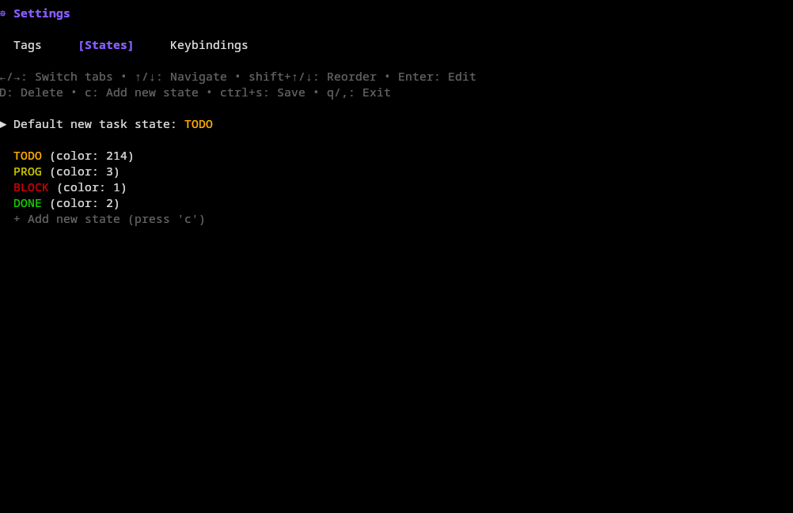
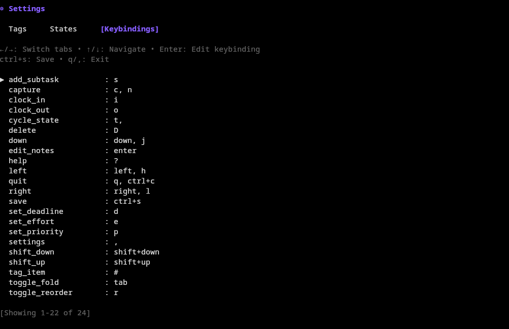

# Org

A simple terminal-based Org-mode task manager inspired by the simplicity of `nano`. Manage your TODO items, track time, and stay organized without leaving the command line.

## Installation

```bash
go install github.com/rwejlgaard/org/cmd/org@latest
```

Or build from source:
```bash
git clone https://github.com/rwejlgaard/org
cd org
go build -o bin/org ./cmd/org
```

## Usage

```bash
org                      # Open ./todo.org (default)
org tasks.org            # Open specific org file
org /path/to/work.org    # Open specific org file with path
org -m                   # Multi-file: Load all .org files in current directory
org -m /path/to/dir      # Multi-file: Load all .org files in specified directory
```

### Single-File Mode (Default)

By default, `org` opens `./todo.org` or the file you specify:

```bash
org                      # Opens ./todo.org
org tasks.org            # Opens tasks.org
org ~/work/project.org   # Opens specific file
```

### Multi-File Mode

Use the `-m` or `--multi` flag to load all `.org` files in a directory as top-level items. Each file appears as a top-level item in the interface, with its contents nested underneath. Changes made to items are automatically saved back to their respective files.

```bash
org -m                   # Load all .org files in current directory
org -m /path/to/dir      # Load all .org files in specified directory
```

**Example:** If you have these files in your directory:
- `work.org` containing work tasks
- `personal.org` containing personal tasks
- `ideas.org` containing project ideas

Running `org -m` will display:
```
* work.org
** TODO Complete project proposal
** PROG Review code changes
* personal.org
** TODO Buy groceries
* ideas.org
** New app concept
```

## Contributing

Feel free to fork and create a pull request if there's any features missing for your own use case!

## Features

### Task Management
- **Customizable TODO States**: Define your own workflow states with custom colors (default: TODO, PROG, BLOCK, DONE)
- **Hierarchical Tasks**: Create sub-tasks and organize items with multiple levels
- **Priority Levels**: Set priorities (A, B, C) with color-coded indicators
- **Tags**: Organize tasks with tags like `:work:urgent:` with customizable colors
- **Folding**: Collapse and expand tasks and notes with Tab key
- **Quick Capture**: Press 'c' to quickly capture new TODO items
- **Reorder Mode**: Reorganize tasks with shift+up/down arrows

### Scheduling & Deadlines
- **Deadlines**: Set and track task deadlines with visual indicators
- **Scheduled Dates**: Schedule tasks for specific dates
- **Agenda View**: View upcoming tasks for the next 7 days
- **Overdue Highlighting**: Automatically highlights overdue items in red

### Time Tracking
- **Clock In/Out**: Track time spent on tasks with 'i' (clock in) and 'o' (clock out)
- **Duration Display**: See current and total time tracked per task
- **Effort Estimates**: Set estimated effort (e.g., 8h, 2d, 1w)
- **Automatic Logging**: All clock entries are logged in LOGBOOK drawer

### Notes & Documentation
- **Rich Notes**: Add detailed notes to any task with Enter key
- **Syntax Highlighting**: Code blocks are automatically highlighted (supports both ```lang and #+BEGIN_SRC formats)
- **Markdown Support**: Use markdown-style code blocks in your notes
- **Drawer Management**: LOGBOOK and PROPERTIES drawers are automatically filtered in list view

### Keybindings

| Key | Action |
|-----|--------|
| `↑/k`, `↓/j` | Navigate up/down |
| `←/h`, `→/l` | Cycle state backward/forward |
| `t` or `space` | Cycle TODO state |
| `tab` | Fold/unfold item |
| `enter` | Edit notes |
| `c` | Capture new TODO |
| `s` | Add sub-task |
| `D` | Delete item (with confirmation) |
| `R` | Rename item |
| `#` | Add/edit tags |
| `a` | Toggle agenda view |
| `i` | Clock in |
| `o` | Clock out |
| `d` | Set deadline |
| `p` | Set priority |
| `e` | Set effort |
| `r` | Toggle reorder mode |
| `shift+↑/↓` | Move item up/down |
| `sift+←/→` | Promote/demote item |
| `,` | Open settings |
| `ctrl+s` | Force save |
| `?` | Toggle help |
| `q` or `ctrl+c` | Quit |

**Note**: All keybindings can be customized in the configuration file.

### Auto-save
Changes are automatically saved when you quit the application.

## Screenshots

### List view


### Editing notes


### Prompts




### Settings




## Configuration

The application can be configured using a TOML configuration file located at:
- Linux/macOS: `~/.config/org/config.toml`
- Windows: `%APPDATA%\org\config.toml`

The configuration file is automatically created with default values on first run.

### Configuration Structure

#### Tags
Define custom tags with colors:
```toml
[tags]
enabled = true
default_tag = "work"

[[tags.tags]]
name = "work"
color = "99"  # Blue

[[tags.tags]]
name = "personal"
color = "141"  # Purple

[[tags.tags]]
name = "urgent"
color = "196"  # Red
```

#### States
Customize TODO states with colors:
```toml
[states]
[[states.states]]
name = "TODO"
color = "202"  # Orange

[[states.states]]
name = "PROG"
color = "220"  # Yellow

[[states.states]]
name = "BLOCK"
color = "196"  # Red

[[states.states]]
name = "DONE"
color = "34"   # Green
```

#### Colors
Customize UI colors (using ANSI color codes):
```toml
[colors]
todo = "202"      # Orange
progress = "220"  # Yellow
blocked = "196"   # Red
done = "34"       # Green
cursor = "240"    # Gray
title = "99"      # Blue
scheduled = "141" # Purple
overdue = "196"   # Red
status = "241"    # Dark gray
note = "246"      # Light gray
folded = "243"    # Medium gray
```

#### Keybindings
Customize all keybindings (can specify multiple keys per action):
```toml
[keybindings]
up = ["up", "k"]
down = ["down", "j"]
left = ["left", "h"]
right = ["right", "l"]
cycle_state = ["t", " "]
toggle_fold = ["tab"]
edit_notes = ["enter"]
capture = ["c"]
add_subtask = ["s"]
delete = ["D"]
tag_item = ["#"]
settings = [","]
toggle_view = ["a"]
save = ["ctrl+s"]
help = ["?"]
quit = ["q", "ctrl+c"]
# ... and more
```

### Settings UI

Press `,` (comma) to open the settings interface where you can:

#### Tags Tab
- Add new tags with custom colors
- Edit tag names and colors (format: `name,color`)
- Delete tags with `D`
- Reorder tags with `shift+up/down`

#### States Tab
- Add new TODO states with custom colors
- Edit state names and colors (format: `name,color`)
- Delete states with `D`
- Reorder states with `shift+up/down` (affects cycling order)

#### Keybindings Tab
- View all keybindings
- Edit keybindings (format: comma-separated keys, e.g., `up,k`)
- Multiple keys can be bound to the same action

**Navigation**: Use left/right arrows to switch between tabs
**Auto-save**: All changes are automatically saved to the config file

## File Format

The application uses standard Org-mode file format (.org), making it compatible with Emacs Org-mode and other Org-mode tools. Tags are stored in the standard org-mode format:

```org
* TODO Task title :work:urgent:
* DONE Completed task :personal:
```

## License

MIT